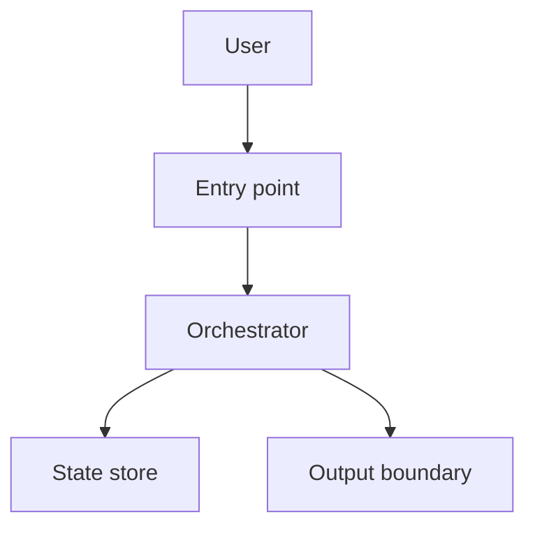
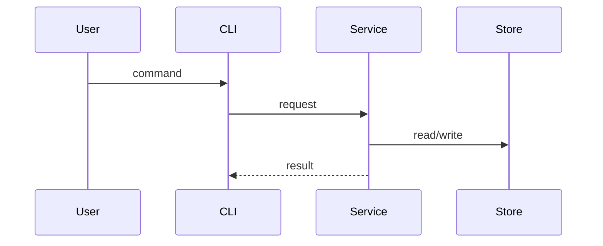

# Artifact Readability

Use this rule when a skill writes durable blueprints or reports that a human
will review later. Keep artifacts easy to scan without making them decorative.

## When To Add Diagrams

Add a Mermaid diagram when the work involves any of these:

- architecture across multiple modules or services
- request, command, event, or data flow across boundaries
- state transitions, queues, retries, caches, or persistence
- multi-phase implementation dependencies
- root-cause hypotheses that depend on path or timing

Do not add a diagram for trivial single-file changes, linear prose that is
clearer than a graphic, or flows you cannot support with evidence. Omit the
diagram section entirely unless its absence would itself be surprising.

## Mermaid Rules

- Use `flowchart TD` for architecture, dependency, and component maps.
- Use `sequenceDiagram` for request, command, event, and user flows.
- Keep diagrams small: 5-12 nodes. Split larger systems by boundary.
- Use simple alphanumeric node IDs where possible.
- Quote labels in brackets: `API["POST /v1/items"]`.
- Avoid reserved words as IDs. Prefer `DoneNode` over `End`.
- Put diagrams near the section they explain, not only in an appendix.
- Back a diagram with a trace or evidence table when later work must map its
  nodes to exact code or configuration.

### System Map Example



### Request Flow Example



## Trace Tables

Use trace tables to keep diagrams honest:

| Step | Code / Config | Responsibility | Evidence |
| ---- | ------------- | -------------- | -------- |
| 1 | `path/file.ts:10` | Receives request | source reading |
| 2 | `path/store.ts:22` | Persists state | execution verified |

## Evidence Labels

Use coarse labels tied to verification method:

| Label | Meaning |
| ----- | ------- |
| `source reading` | Verified by reading cited code or docs. |
| `execution verified` | Verified by running tests, probes, builds, or commands. |
| `production/tool data` | Verified by logs, CI, GitHub metadata, dashboards, or other tools. |
| `inferred` | Plausible from evidence but not directly proven; state what would prove it. |
| `unknown` | Not verified; list under open questions, not as a claim. |

Prefer `source reading` or stronger for architecture claims. Use `inferred`
sparingly and explain the missing evidence.

## Standard Sections

Use only the sections that improve the artifact:

```markdown
## Human-Readable Map

### System Map

<Mermaid flowchart>

### Request / Data Flow

<Mermaid sequence diagram>

### Flow Trace

| Step | Code / Config | Responsibility | Evidence |
| ---- | ------------- | -------------- | -------- |

## Evidence Summary

| Claim | Evidence | Verification | Confidence |
| ----- | -------- | ------------ | ---------- |

## Investigation Log

- Commands run:
- Tests/probes:
- External docs/tools:
- Gaps:
```

For diagnosis or review synthesis, add a cross-reference matrix:

```markdown
## Evidence Cross-Reference

| Finding / Hypothesis | Source evidence | Execution evidence | Tool data | Confidence |
| -------------------- | --------------- | ------------------ | --------- | ---------- |
```

## Anti-Noise Rules

- Put the decision or summary first; diagrams support it but do not replace it.
- Do not force diagrams into tiny or single-file changes.
- Do not claim more certainty than the evidence supports.
- Keep raw logs and long command output out of the review path.
- Keep shared skills portable: no harness-specific task stores, native
  subagent requirements, chat-only state, Slack envelopes, or external state
  repository assumptions.
